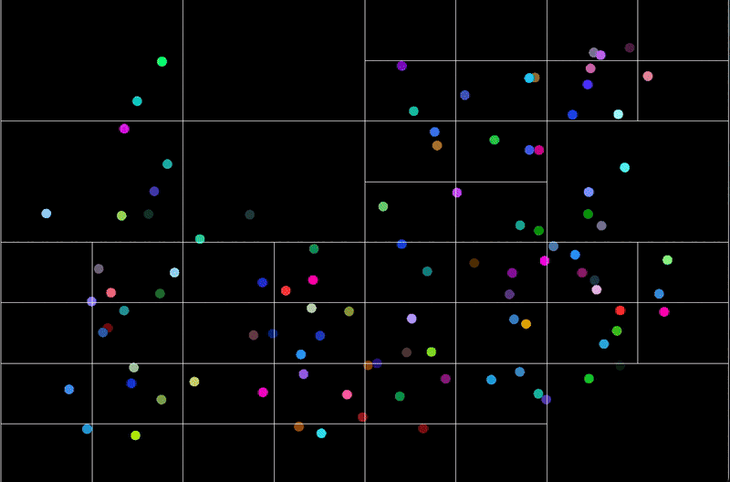
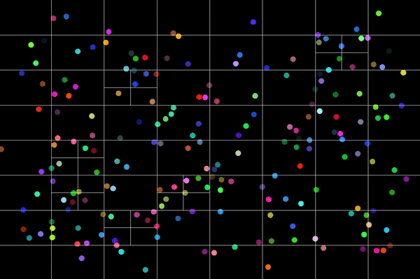

### Particle Life

This is a simple particle life simulation. Particles are created at random positions and move in random directions. 

### Quadtree
Implementing quadtree for collision detection:  

### Collisions
Implemented collision detection using quadtree. The quadtree is used to divide the space into smaller regions and store the particles in the regions. This allows for faster collision detection as we only need to check for collisions between particles in the same region:  

### Particle Life
This is a simple particle life simulation. Particles are created at random positions and move in random directions initially. There is a attraction force based on the color of the particles. Here, it starts with no forces, then all red particles are attracted to each other, then all green particles are attracted to red particles. It is interesting to see how the particles move based on the forces.

